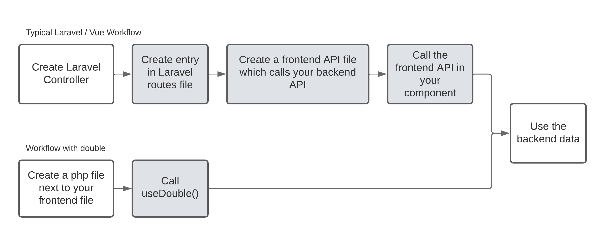

<div id="top"></div>

<br />
<div align="center">

  

  <p align="center">
    The missing link between Laravel and Vue
    <br />
    <br />
    <a href="https://github.com/Sopamo/double-vue/issues">Report Bug</a>
    ·
    <a href="https://github.com/Sopamo/double-vue/discussions">Give Feedback</a>
  </p>
</div>

<br>

## About Double

Double drastically simplifies writing Vue applications with a Laravel backend. It does so, by removing all of the API boilerplate code you have to write.




### How does it work?
Traditionally, your API code lives in  `App\Http\Controllers\UsersController`. You also have to create an entry in your routes file, and write some frontend boilerplate code to call that API.

When using Double, you place your API code next to your vue store / component files. For example you would have your vue store in `stores/users.ts` and your API code for that store in `stores/users.php`.

This let's Double automatically associate your API code with your frontend code. By creating *closeness* in the file system, you don't need to manually connect your server-side code with your frontend.

🚀 Double also analyzes your PHP code and intelligently creates TypeScript definitions!

### Why?

* Double removes the need for any API boilerplate code
* Double automatically gives you TypeScript types for your backend API
* Double integrates with pinia

<p align="right">(<a href="#top">back to top</a>)</p>

## Code says a thousand words
The following two files are everything you need for having a vue component which displays all users of your app:

*/double/src/components/users.php*
```php
<?php
return new class {
    public function getUsers()
    {
        // We return a static array here, but you can access all 
        // Laravel features here. Something like:
        //   return User::all();
        // would work as well.
        return [
          [
            'id' => 1,
            'username' => 'Quentin'
          ]
        ];
    }
};
?>
```
*/double/src/components/users.vue*
```vue
<template>
    <h2>Users</h2>
    <!--
      `Double` automatically loads and injects the response
       from the getUsers method into the users variable
     -->
    <div v-for="user in users">
        <strong>{{ user.username }}</strong> #{{ user.id }}
    </div>
</template>

<script lang="ts">
    import { defineComponent } from 'vue'
    import { useDouble } from "double-vue";

    export default defineComponent({
        async setup() {
            const double = await useDouble('/src/components/users')
            return {
                ...double,
            }
        },
    })
</script>
```

Yep, that's it! No need to write any API boilerplate code. All methods from the PHP file are intelligently mapped to your frontend code. Read on to discover more complex usage examples.

## Installation

This is an example of how you may give instructions on setting up your project locally.
To get a local copy up and running follow these simple example steps.


1. Setup a [new Laravel project](https://laravel.com/docs/9.x/installation), or use an existing one


### **Vue setup**
   1. Setup a vue project in the `double` subfolder
      1. [Install](https://cli.vuejs.org/guide/installation.html) the vue cli
      2. Go to your laravel installation
      3. Create a new vue project `vue create double`. Make sure to select "Manually select features" and then check "Typescript" and "vue3".
   3. Setup double in the new vue project
      1. `cd double`
      2. `npm install double-vue`
      3. In src/main.ts add the following lines before the `createApp(App)` call:
         ```js
         import { installDouble } from 'double-vue'

         installDouble('http://localhost/api/double', 'webpack')
         ``` 
         Make sure to replace `localhost` with the domain that your laravel project is running at
      4. Add this `vue.config.js` file:
          ```js
          const { defineConfig } = require('@vue/cli-service')
          const { doubleWebpackPlugin } = require('double-vue/bundler')
          const path = require("path")

          module.exports = defineConfig({
            transpileDependencies: true,
            configureWebpack: {
              plugins: [
                  doubleWebpackPlugin()
              ]
            }
          })
          ```
      5. `npm run serve`

### **Laravel setup**
1. Go back to your laravel installation
2. `composer require sopamo/double-laravel`
3. `php artisan vendor:publish --provider="Sopamo\Double\DoubleServiceProvider"`


### **Use double**
   1. Create the two example files from above (users.php and users.vue) in the `double/src/components` folder to get a working example of double.
   2. Use your new users.vue component by embedding it with a `<suspense>` component like so:
      ```
      <suspense>
        <users />
      </suspense>
      ```


<p align="right">(<a href="#top">back to top</a>)</p>


## Usage

### PHP naming conventions
The code you write in the PHP files next to your frontend files always have to return a single class:

```php
<?php
use Illuminate\Http\Request;
use App\Models\User;

return new class {
    public function getUsers()
    {
      return  Users::all();
    }

    public function storeUser(Request $request) {
      $user = new User();
      $user->username = $request->input('username');
      $user->save();
    }
};
?>
```

Define the data that you want to receive as *state* with methods starting with `get`, followed by an uppercase letter.
This data will automatically be fetched when Double initializes.

All other public methods are available as actions:

```js
import { useDouble } from 'double-vue'

const double = useDouble('/src/pages/users')

// This will contain the return value of the getUsers method
console.log(double.users)

// This will call the storeUser method
double.storeUser({username: 'Bob Marley'})
```

### Refreshing the state
Sometimes you want to update the Double state with the latest data from the server. Use the `refresh` method for that:

```js
double.refresh()
```

### Parameters for state methods
Sometimes you want to configure state fetching methods dynamically, for example if you don't want to return all users, but only users which match a given query:

```js
import { useDouble } from 'double-vue'

const userQuery = ref('Bob')

const double = useDouble('/src/pages/users', {
  getUsers: {
    search: userQuery
  }
})

// This will automatically trigger a refresh, then loading all users which match the query "Johnny"
userQuery.value = 'Johnny'
```

You can use the normal Laravel methods to access the search parameter:
```php
$request->input('search') // Contains "Bob"
```

### Sending custom headers
If you are not using cookie-based authentication, you will want to set an authorization header in the requests that Double sends:

```js
import { setCustomHeader } from 'double-vue'

setCustomHeader('Authorization', 'Bearer ' + yourToken)
```


<p align="right">(<a href="#top">back to top</a>)</p>


## Roadmap

- [ ] Create a screencast
- [ ] PHPStorm setup instructions
- [ ] Configure double-vue api endpoint via .env
- [x] Finalize readme
- [x] Add support to configure the data requests in pinia
- [x] Finalize the example project
- [x] Unify double between regular usage and pinia
- [x] Fix HMR breaking in sample project
- [x] Add support for the refresh method outside of pinia
- [x] Error handling
- [x] Ignore private / protected php methods

<p align="right">(<a href="#top">back to top</a>)</p>


## Contributing

Contributions are what make the open source community such an amazing place to learn, inspire, and create. Any contributions you make are **greatly appreciated**.

If you have a suggestion on how to improve Double, please fork the repo and create a pull request. You can also simply open an issue with any questions or bugs you find.
Don't forget to give the project a star! Thanks again!

<p align="right">(<a href="#top">back to top</a>)</p>


## License

Distributed under the MIT License. See `LICENSE.txt` for more information.

<p align="right">(<a href="#top">back to top</a>)</p>
